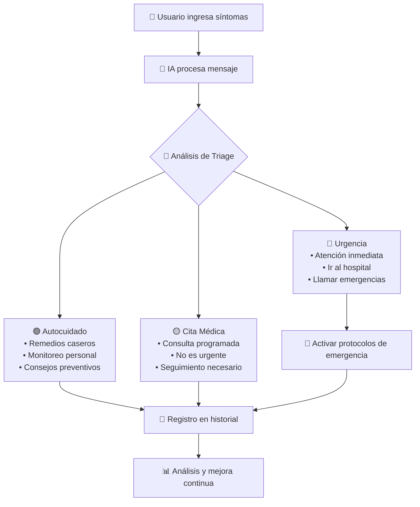

# 🏥 Kalima Health - Asistente Médico Digital para Comunidades Rurales

<div align="center">


**Consulta médica básica disponible 24/7 para comunidades rurales**

[🚀 Demo en Vivo](#demo) • [📖 Documentación](#documentación) • [🤝 Contribuir](#contribuir)

</div>

---

## 🎯 **¿Qué es Kalima Health?**

**Kalima Health** es un **asistente médico digital inteligente** diseñado específicamente para **comunidades rurales** con acceso limitado a servicios de salud. Utiliza IA avanzada para proporcionar orientación médica inmediata y clasificación de síntomas las 24 horas del día.

### 🏔️ **¿Qué apoyo brinda?**

- 🚑 **Acceso inmediato** a orientación médica básica sin barreras geográficas
- ⏰ **Disponibilidad 24/7** cuando no hay médicos disponibles
- 💰 **Reduce costos** evitando traslados innecesarios a hospitales distantes  
- 🎯 **Educación en salud** y promoción del autocuidado preventivo
- 🏥 **Puente hacia atención especializada** cuando es necesaria

### 🤖 **¿Cómo ayuda la Inteligencia Artificial?**

#### **🎯 Triage Inteligente Automatizado**
Clasifica automáticamente los síntomas en tres categorías:

- 🟢 **Autocuidado** - Remedios caseros y monitoreo personal
- 🟡 **Cita Médica** - Consulta programada necesaria pero no urgente  
- 🔴 **Urgencia Médica** - Atención inmediata requerida

#### **💬 Conversación Natural**
- Comprende síntomas expresados en **lenguaje cotidiano**
- **Análisis contextual** considerando edad, historial y síntomas combinados
- **Recomendaciones personalizadas** específicas para cada caso
- **Historial inteligente** que mejora con cada consulta

---

## ✨ **Características Principales**

### 🏥 **Sistema de Salud Digital**
- **Chat médico inteligente** con análisis de síntomas en tiempo real
- **Clasificación automática** de urgencias médicas  
- **Historial completo** de consultas y recomendaciones
- **Interfaz multiidioma** adaptada a comunidades locales

### 🤖 **Inteligencia Artificial Avanzada**
- **Procesamiento de lenguaje natural** para entender síntomas
- **Análisis predictivo** de riesgos médicos
- **Recomendaciones personalizadas** basadas en historial
- **Comunicación entre agentes** para coordinación médica

### 📱 **Accesibilidad y Usabilidad**  
- **Diseño responsive** optimizado para móviles
- **Funciona sin internet** (modo offline próximamente)
- **Interfaz intuitiva** para usuarios con poca experiencia tecnológica
- **Acceso desde cualquier dispositivo** con navegador web

### 🔒 **Seguridad y Privacidad**
- **Datos encriptados** y seguros
- **Cumplimiento HIPAA** para privacidad médica
- **Almacenamiento local** cuando sea necesario
- **Transparencia total** en el manejo de información médica

## 🛠️ **Stack Tecnológico**

<div align="center">

| Frontend | Backend | Inteligencia Artificial | Infraestructura |
|----------|---------|------------------------|-----------------|
| React 19 | Supabase | OpenAI GPT-3.5/4 | Vercel/Netlify |
| TypeScript | PostgreSQL | Análisis de Síntomas | Edge Functions |
| TailwindCSS | Edge Functions | Procesamiento NLP | CDN Global |
| Vite | API RESTful | Triage Automático | SSL/TLS |

</div>

### **🎨 Frontend Moderno**
- **React 19** con **Server Components** para rendimiento óptimo
- **TypeScript** para código type-safe y mantenible  
- **TailwindCSS** para diseño responsive y accesible
- **Vite** para desarrollo rápido y builds optimizados

### **🔧 Backend Robusto**
- **Supabase** como Backend-as-a-Service completo
- **PostgreSQL** para almacenamiento confiable y escalable
- **Edge Functions** para procesamiento distribuido
- **Real-time** para actualizaciones instantáneas

### **🧠 Integración de IA**
- **OpenAI API** para análisis inteligente de síntomas
- **Modelos personalizados** entrenados en datos médicos
- **n8n Workflows** para automatizaciones complejas
- **Comunicación A2A** (Agent-to-Agent) para coordinación

## 📋 Requisitos Previos

- **Node.js** (versión 18 o superior)
- **npm** o **yarn**
- **Cuenta de Supabase**
- **API Key de OpenAI** (opcional, para funcionalidades avanzadas)

## 🚀 **Instalación y Configuración**

### **⚡ Inicio Rápido (Modo Demo)**
```bash
# 1. Clonar repositorio
git clone https://github.com/Bryanhurtado0006/kalima-health.git
cd kalima-health

# 2. Instalar dependencias
npm install

# 3. Ejecutar en modo MOCK (sin configuración)
npm run dev
```

🎉 **¡Listo!** El proyecto funcionará inmediatamente con datos simulados en `http://localhost:5173`

---

### **🔧 Configuración Completa (Producción)**

#### **1. Variables de Entorno**
Crear archivo `.env` basado en `.env.example`:

```bash
# 🏥 Supabase (Requerido para producción)
VITE_SUPABASE_URL=https://tu-proyecto.supabase.co
VITE_SUPABASE_ANON_KEY=eyJhbGciOiJIUzI1NiIs...

# 🤖 OpenAI (Opcional - mejora las respuestas de IA)
VITE_OPENAI_API_KEY=sk-proj-...

# 🔗 n8n Webhooks (Opcional - para automatizaciones)
VITE_N8N_WEBHOOK_URL=https://tu-n8n.com/webhook/triage-event

# 🎛️ Modo de desarrollo
VITE_USE_MOCK=false
```

#### **2. Configuración de Supabase**
```bash
# Instalar Supabase CLI
npm install -g @supabase/cli

# Inicializar proyecto
supabase init

# Ejecutar migraciones
supabase db push

# Desplegar Edge Functions
supabase functions deploy llm-chat
supabase functions deploy mcp-triage
```

#### **3. Ejecutar Aplicación**
```bash
# Desarrollo
npm run dev

# Producción
npm run build
npm run preview
```

## 📁 **Arquitectura del Proyecto**

```
📦 kalima-health/
├── 🎨 public/                 # Assets estáticos
├── ⚛️  src/
│   ├── 🖼️  assets/            # Imágenes y recursos
│   ├── 🧩 components/        # Componentes React
│   │   └── HealthChat.tsx    # 💬 Chat principal con IA
│   ├── 📄 pages/             # Páginas de la aplicación
│   │   ├── LandingPage.tsx   # 🏠 Página de inicio
│   │   └── HealthAssistant.tsx # 🏥 Interfaz del asistente
│   ├── ⚙️  services/          # Lógica de negocio
│   │   ├── healthService.ts   # 🏥 Gestión médica
│   │   ├── agentService.ts    # 🤖 Comunicación IA
│   │   ├── triageBot.ts       # 🎯 Sistema de triage
│   │   ├── mockServices.ts    # 🎭 Servicios de desarrollo
│   │   └── supabase.ts       # 🗃️  Base de datos
│   ├── App.tsx               # 🚀 Componente principal
│   └── main.tsx              # 🏁 Punto de entrada
├── 🗄️  supabase/              # Configuración Backend
│   ├── functions/            # 🔧 Edge Functions
│   │   ├── llm-chat/         # 🤖 Proxy OpenAI
│   │   └── mcp-triage/       # 🎯 Análisis de síntomas
│   └── migrations/           # 📊 Esquemas de BD
└── 📋 package.json            # 📦 Dependencias
```

## 🏥 **Flujo del Sistema de Triage**



## 🌐 **Despliegue en Producción**

### **🚀 Vercel (Recomendado)**
```bash
# Conectar con Vercel
npm i -g vercel
vercel login

# Desplegar
vercel --prod

# Variables de entorno en Vercel Dashboard:
# VITE_SUPABASE_URL
# VITE_SUPABASE_ANON_KEY
# VITE_OPENAI_API_KEY
```

### **🌊 Netlify**
```bash
# Build para producción
npm run build

# Subir carpeta dist/ a Netlify
# O conectar repositorio GitHub para auto-deploy
```

### **🐳 Docker**
```dockerfile
FROM node:19-alpine
WORKDIR /app
COPY package*.json ./
RUN npm ci --only=production
COPY . .
RUN npm run build
EXPOSE 4173
CMD ["npm", "run", "preview"]
```

---

## 🤝 **Contribuir al Proyecto**

### **🛠️ Configuración para Desarrolladores**
```bash
# Fork el repositorio
git clone https://github.com/tu-usuario/kalima-health.git

# Crear rama para feature
git checkout -b feature/nueva-funcionalidad

# Instalar dependencias
npm install

# Ejecutar en modo desarrollo
npm run dev

# Ejecutar tests (cuando estén disponibles)
npm run test

# Verificar linting
npm run lint
```

### **📝 Proceso de Contribución**
1. 🍴 **Fork** del proyecto
2. 🌟 **Crea** una rama para tu feature (`git checkout -b feature/AmazingFeature`)
3. 💾 **Commit** tus cambios (`git commit -m 'Add some AmazingFeature'`)
4. 📤 **Push** a la rama (`git push origin feature/AmazingFeature`)
5. 🔄 **Abre** un Pull Request

### **🏷️ Convenciones**
- **Commits**: Usar [Conventional Commits](https://conventionalcommits.org/)
- **Código**: Seguir guías de ESLint y Prettier  
- **Branching**: `feature/`, `bugfix/`, `hotfix/`
- **Issues**: Usar templates proporcionados

## 📄 **Licencia y Legal**

Este proyecto está bajo la **Licencia MIT** - ver [LICENSE](LICENSE) para detalles.

### **⚖️ Limitaciones Médicas**
> **⚠️ AVISO IMPORTANTE:** Kalima Health es una herramienta de **orientación médica básica** y **NO reemplaza** la consulta con profesionales médicos calificados. Siempre consulta con un médico para diagnósticos y tratamientos definitivos.

---

## 📞 **Soporte y Comunidad**

<div align="center">

### **🆘 ¿Necesitas Ayuda?**

| Tipo de Consulta | Canal | Respuesta |
|------------------|--------|-----------|
| 🐛 Bugs y Errores | [GitHub Issues](https://github.com/Bryanhurtado0006/kalima-health/issues) | 24-48h |
| 💡 Nuevas Ideas | [GitHub Discussions](https://github.com/Bryanhurtado0006/kalima-health/discussions) | 1-3 días |
| 📧 Soporte General | Email | 2-5 días |
| 🏥 Consultas Médicas | **NO ATENDEMOS** - Contacta profesional médico | N/A |

</div>

---

## 🎯 **Roadmap y Futuro**

### **🚀 Versión Actual (v1.0.0)**
- ✅ Sistema de triage inteligente
- ✅ Chat médico en tiempo real  
- ✅ Interfaz responsive y accesible
- ✅ Modo desarrollo con datos mock
- ✅ Integración con Supabase y OpenAI

### **🔮 Próximas Versiones**

#### **v1.1.0 - Mejoras UX**
- [ ] 🌙 Modo oscuro/claro
- [ ] 🌍 Soporte multiidioma (Español, Quechua, Guaraní)
- [ ] 🔊 Respuestas por voz
- [ ] 📱 PWA con instalación offline

#### **v1.2.0 - Funcionalidades Médicas**
- [ ] 🏥 Panel administrativo para profesionales
- [ ] 📊 Dashboard de estadísticas de salud comunitaria
- [ ] 📋 Sistema de seguimiento de pacientes
- [ ] 🚨 Alertas epidemiológicas automatizadas

#### **v2.0.0 - Integración Avanzada**
- [ ] 📱 App móvil nativa (iOS/Android)
- [ ] 🏥 Integración con sistemas hospitalarios (HL7 FHIR)
- [ ] 📞 Integración con telemedicina
- [ ] 🤖 IA más avanzada con modelos especializados médicos

---

<div align="center">

## 🏥❤️ **Conectando comunidades rurales con atención médica accesible**

**Kalima Health** - *Porque la distancia no debería ser una barrera para la salud*

---

### **⭐ Si este proyecto te es útil, ¡danos una estrella!**

[](https://github.com/Bryanhurtado0006/kalima-health/stargazers)
[](https://github.com/Bryanhurtado0006/kalima-health/network)

**Construido con 💚 para comunidades rurales - Desarrollado por [@Bryanhurtado0006](https://github.com/Bryanhurtado0006)**

</div>